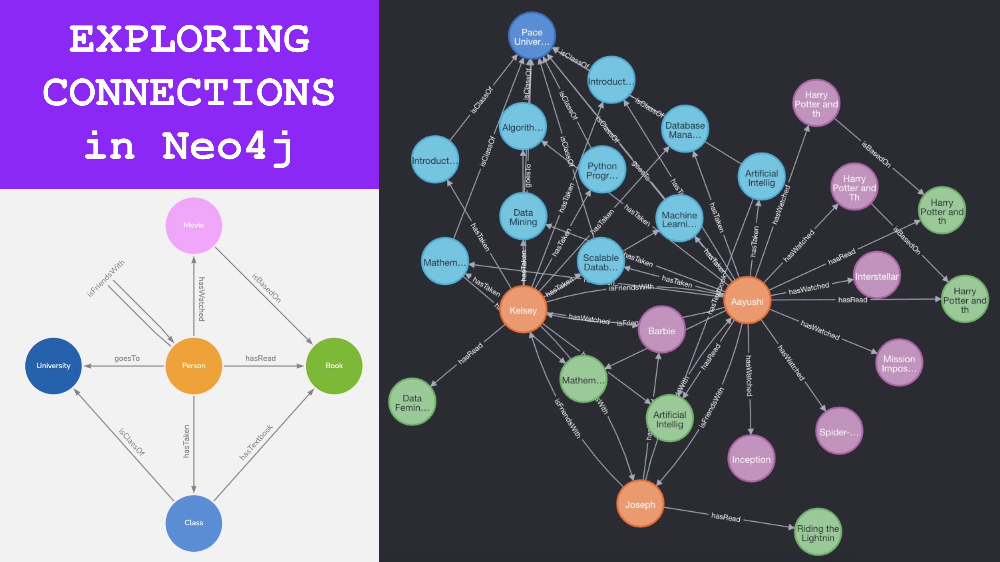
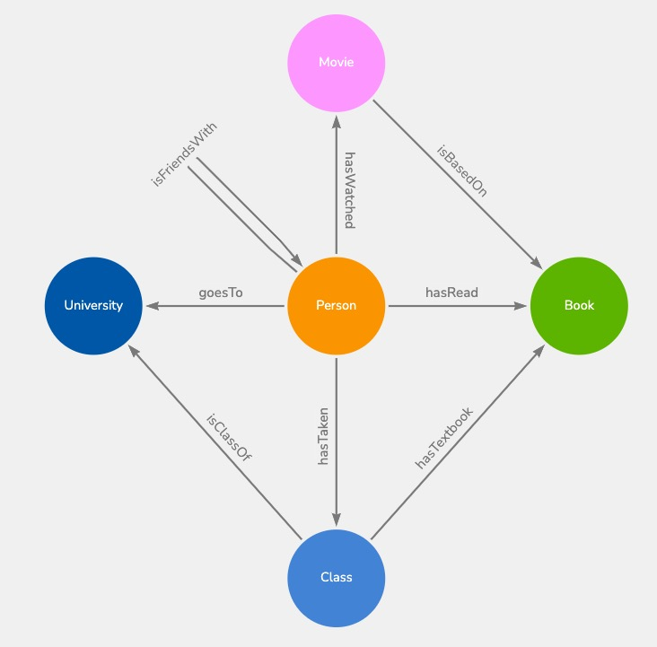

# Exploring-Our-Connections
Repository to store materials for our group project using Neo4j. We created a video walkthrough of the code and project here: https://youtu.be/_NO4wwGkpRo

## Table Of Contents

- [Introduction](#introduction)
- [Data Model](#data-model)
- [Database Selection](#database-selection)
- [Querying The Graph](#querying-the-graph)
- [Conclusion](#conclusion)



## Introduction

In today’s globalized world, we are constantly making new connections to each other, either directly or indirectly. For example, we (Aayushi and [Kelsey](https://github.com/woodskd24)) are both doing our online Master’s in Data Science at Pace University together. Prior to this, we had never met each other, but now we are really good friends, despite the fact we still haven’t met each other in real life. We thought it would be an interesting analysis to see how the both of us are connected in a world where we lead separate lives.

## Data Model

We decided to create our own dataset with nodes and edges, and created a [data model](https://drive.google.com/file/d/1nEJHu4ktHXmzy2NYeHjctNhPIghmfTPg/view?usp=sharing) using an application called [Arrows.app](https://arrows.app/), with nodes that represent entities, and edges that represent relationships.



## Database Selection

We decided to use a graph database, specifically [Neo4j](https://neo4j.com/), to ingest our data and run the queries for many reasons, for example:

- It represents the complex relationships in our dataset very well
    - Very easy to understand and visualize as well!
- It allows for complex data exploration
    - We were able to look at complex data relationships throughout the process and fairly easily
- It is great for pattern matching
    - We were able to infer patterns by its graphical nature and easy to understand displays
- Scalability
    - If we wanted to expand out the project even more we would easily have that capability
- Flexibility
    - Trends emerge as the data changed. 
    - This gave us a better understanding of the data

## Querying The Graph

The text file ```cypher_queries.txt``` contains the queries that we wrote to create the nodes and edges, and to explore the network. 

## Conclusion

Using Neo4j’s cypher query language, we created a custom dataset to explore our connections to each other, and gained some interesting insights. These queries can be expanded to include more data and to create a more complex social network.

[back to top](#table-of-contents)
